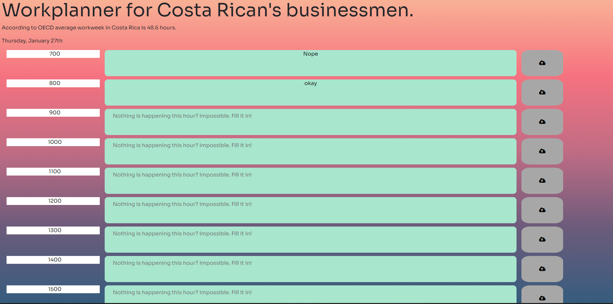

# Day Planning

## Description

"A worker from Coasta Rica is so busy that they needed a planner to help them sort the day out, with important events and other things that needed to be done"

Published at: https://corhydare.github.io/PlannerOfDays/

Following instructions were given:

```md
GIVEN I am using a daily planner to create a schedule
WHEN I open the planner
THEN the current day is displayed at the top of the calendar
WHEN I scroll down
THEN I am presented with timeblocks for standard business hours
WHEN I view the timeblocks for that day
THEN each timeblock is color coded to indicate whether it is in the past, present, or future
WHEN I click into a timeblock
THEN I can enter an event
WHEN I click the save button for that timeblock
THEN the text for that event is saved in local storage
WHEN I refresh the page
THEN the saved events persist
```

### most of the struggle was with .js file:

```javascript
    function Crayons() {
      var currentTime = new Date().getHours();
      for (var i = 7; i < 22; i++) {
        // decide what to color, in a loop, for each created row it updates the time and color.

        if ($(`#${i}`).data("time") == currentTime) {
          $(`#text${i}`).addClass("nearBy");
        } else if (currentTime < $(`#${i}`).data("time")) {
          $(`#text${i}`).addClass("upcoming");
        }
      }
    }
    Crayons();
```

### local storage once again joins in

```javascript
function getLocalStorage(ID) {
  let savings = localStorage.getItem(ID);
  if (savings) {
    $(`#text${ID}`).text(savings);
  }
}
```

## Prompts

In order to keep the quiz clean within a single page there was a need for temproray element removal:

### add one "window" and remove another

```javascript
  qFrame.classList.add("activeQuiz");
  finalDiv.classList.remove("activeResult");
```

### Timer only ran during the quiz:

```javascript
function countdown(time) {
  counter = setInterval(timer, 1000);
  function timer() {
    timeCount.textContent = time;
    time--;
    if (time < 0) {
      clearInterval(counter);
      showResult();
    }
  }
}
```

### questions.js file was indexed and separated for insertion:

```javascript
function countdown(time) {
  counter = setInterval(timer, 1000);
  function timer() {
    timeCount.textContent = time;
    time--;
    if (time < 0) {
      clearInterval(counter);
      showResult();
    }
  }
}
```
## App



## Conclusion

With this section it was neccesary to review a lot of course work, as class time did not adequately prepare me for this project.
Nevertheless the final product was pleasing, especially since I understood how I got there.
